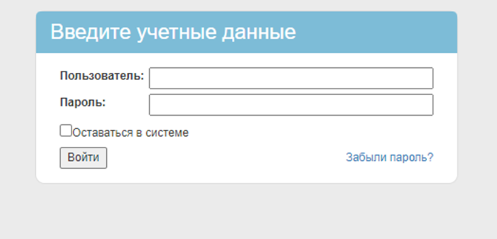
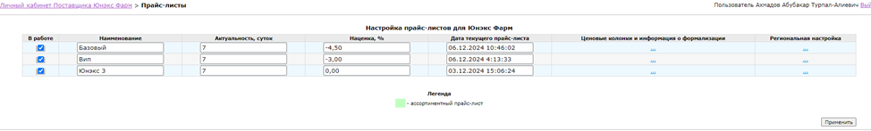
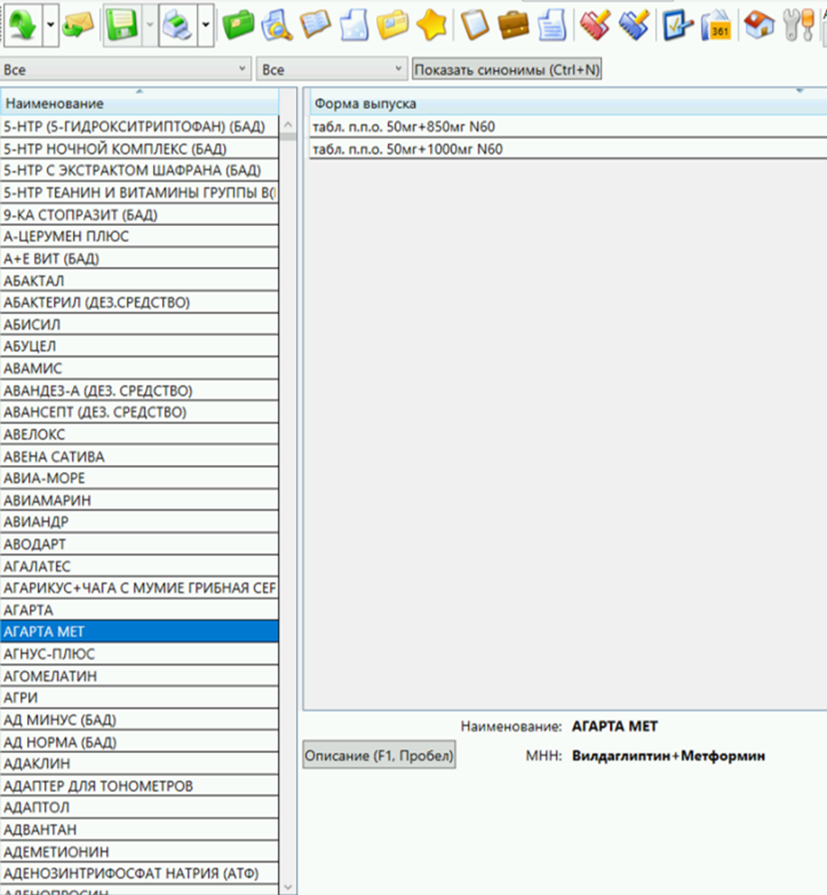

Разработка будет происходить в 3 направлениях:
1.	Клиентская часть. Web интерфейс у пользователей. Локальная БД с синхронизацией с сервером.
2.	WEB админка поставщиков. Интерфейс для работы поставщиков. (Создание прайсов настройка обмена и периодичности)
3.	Сервер. Cron (планировщик заданий). Микросервисы выполняющейся по расписанию.
Задание для разработки.
1.	Создать  WEB админку поставщиков.
Создать таблицу «USERS»
Внести минимально необходимые поля: Краткое наименование (логин), Полное наименование, права доступа ID (поставщик, пользователь аптеки, администратор), HASH пароль, телефон, email. 
Создать таблицу «RIGHTS»
Продумать создание полей. Необходима возможность 1 пользователю быть одновременно в любом сочетании ролей (роли могут добавлятся).
Создать таблицу «SUPPLIERS»
Внести минимально необходимые поля: Краткое наименование, Полное наименование, Регион, Адрес, телефон, email. 
Создать таблицу «PRICES»
Внести минимально необходимые поля: ID контрагента, Дата прайса, Полное наименование препарата, производитель, штрихкод, цена.

Страница авторизации (JWT авторизация)

 
Страница админ панели поставщика.
Создать по аналогии. Меню и функции будут добавляться.
На данный момент интересует только прайс листы (возможность добавлять, отключать), загружать. 

 

добавить кнопку создать прайс.
Рядом с прайсом кнопку загрузить. При нажатии идет загрузка на ftp файла прайса.

2.	Поднять на сервере DOCKER PostgreSQL, создать БД.
Написать сервис загрузки прайса по расписанию (может задаваться для каждого поставщика).
Загрузка с ftp из папки клиента в формате zip. Разархивация и импорт в БД.

3.	Создать страницу авторизации.
Страница авторизации (JWT авторизация)

 
 
Продумать страницу основного меню по аналогии

 
